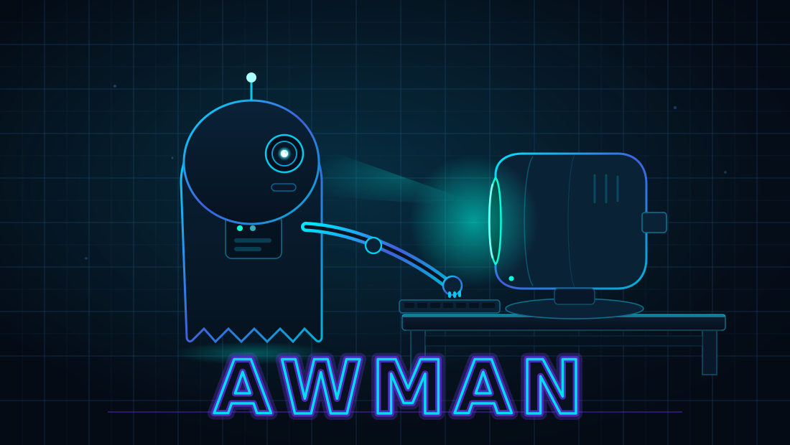
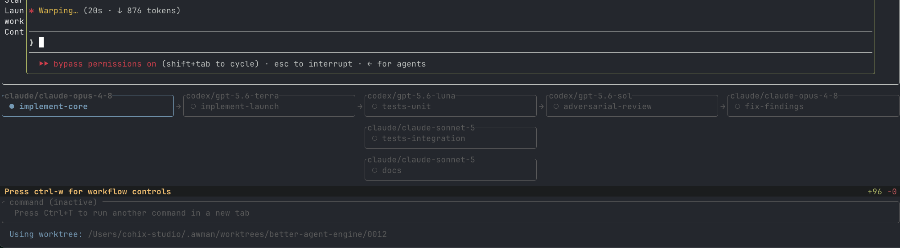

<p align="center">
  <strong>Run and coordinate AI code agents from your terminal.</strong> <br>
  Go from issue to PR with repeatable container-isolated workflows.<br>
  <br>
  
</p>

<p align="center">
  
</p>

---

`awman` (Agent Workflow Manager) is a developer tool that adds structure and automation to the entire agentic software development lifecycle: from issue to merged PR. 

**4 stages of improved agentic software development with awman**
1. Isolate your code agents with containers and worktrees 🛑
2. Run multiple agents in parallel with the TUI. 🔄
3. Create structured workflows for your project's software development lifecycle. 📈
4. Fan out multiple workflows to your homelab or cluster with API mode. 🤝


---

## Installation

```sh
curl -s https://prettysmart.dev/install/awman.sh | sh
```

The installer detects your platform and puts `awman` on your `PATH`.

<details>
<summary>Other installation options</summary>

**With mise** — using the [GitHub backend](https://mise.jdx.dev/dev-tools/backends/github.html):

```sh
mise use -g github:prettysmartdev/awman
```

To pin to a specific version: `mise use -g github:prettysmartdev/awman@0.11.0`

**From GitHub Releases** — download the binary for your platform from [GitHub Releases](https://github.com/prettysmartdev/awman/releases):

| Platform | Asset |
|----------|-------|
| Linux (x86_64) | `awman-linux-amd64` |
| Linux (ARM64) | `awman-linux-arm64` |
| macOS (Intel) | `awman-macos-amd64` |
| macOS (Apple Silicon) | `awman-macos-arm64` |
| Windows (x86_64) | `awman-windows-amd64.exe` |

**From source** — requires Rust 1.94+ and make:

```sh
git clone https://github.com/prettysmartdev/awman.git
cd awman
sudo make install
```

</details>

---

## Quick Start

```sh
# 1. Initialize your repo (once per project)
awman init

# 2. Open the TUI
awman

# 3. Start an agent session
chat

# 4. Optionally run the Dockerfile.dev refresh agent to
#    ensure all your project's tools get installed
ready --refresh
```

See the [Getting Started Guide](docs/00-getting-started.md) for a full walkthrough.

---

## What you can do with `awman`

### Run multiple agents at once

From the `awman` TUI, Open new tabs with **Ctrl+T**. Each tab is independent — its own working directory, its own container, running in the background while you work in another tab. Switch between tabs with **Ctrl+A** / **Ctrl+D**.

If a running agent gets stuck or completes its task, its tab turns yellow so you know to check in.


### Run structured workflows

A workflow breaks complex work into phases — for example, plan → implement → review → docs. Each phase is a separate agent session. You review the output between phases and decide whether to continue, retry, or redirect.

Workflows are TOML or YAML files in your repo. They can include setup and teardown phases to prepare the environment and handle post-workflow actions like committing, pushing, and opening PRs.




```toml
title = "Implement Feature"

[[setup]]
type = "checkout_create_branch"
branch = "feature/{{work_item_number}}"
base = "main"

[[step]]
name = "plan"
prompt = "Read work item {{work_item_content}} and produce an implementation plan."

[[step]]
name = "implement"
depends_on = ["plan"]
prompt = "Implement work item {{work_item_number}} according to the plan."

[[step]]
name = "review"
depends_on = ["implement"]
prompt = "Review the implementation for correctness and style."

[[teardown]]
type = "run_shell"
command = "make test"

[[teardown]]
type = "commit_changes"
message = "Implement {{work_item_number}}"
add_all = true

[[teardown]]
type = "push_branch"
overlays = ["ssh()"]

[[teardown]]
type = "create_pull_request"
title = "Implement {{work_item_number}}"
overlays = ["env(GITHUB_TOKEN)"]
```

```sh
awman exec workflow ./aspec/workflows/implement-pr.toml --work-item 0027
```
Workflows can optionally be passed a specific work item — a spec you've written — to work on new features, fix bugs, etc.


### Combine multiple agents in a single workflow

Each workflow step can specify which agent runs it, and each step can have its own overlays for SSH access, environment variables, or skills:

```toml
[[step]]
name = "implement"
depends_on = ["plan"]
agent = "codex"
prompt = "Implement the plan."

[[step]]
name = "review"
depends_on = ["implement"]
agent = "claude"
prompt = "Review for correctness and style."
overlays = ["skill(review)"]
```

Supported agents: `claude`, `codex`, `opencode`, `maki`, `antigravity`, `copilot`, `crush`, `cline`. Steps without an `agent` field use your project's default.


### Drive work directly from GitHub issues

Point any of `new spec`, `exec workflow`, or `exec prompt` at a GitHub issue with `--issue` — no local work item file needed. awman fetches the issue (via the `gh` CLI, a `GITHUB_TOKEN`, or unauthenticated for public repos) and feeds it in as the input:

```sh
# Generate a work item spec from an issue
awman new spec --issue 84

# Run a workflow against an issue (resolves {{work_item_content}} from the issue body)
awman exec workflow ./aspec/workflows/implement-pr.toml --issue 84 --worktree

# Send an issue straight to the agent as a prompt
awman exec prompt "Security review this" --issue 84
```

A bare number resolves against the current repo's GitHub remote; `owner/repo#84` and full issue URLs also work. See [GitHub Integration](docs/11-github-integration.md).

Workflow setup/teardown phases can also wait on CI: a `poll_ci` step blocks until GitHub Actions goes green, and any step can declare an `on_failure` block that launches an agent to fix the problem and retries.

### Hand off to the agent workflow completely (yolo mode)


`--yolo` disables your agent's permission prompts and auto-advances completed workflow steps. Use it when you have a well-specified task and want to return to a finished result.

```sh
# Implement fully autonomously, changes isolated to a git worktree
awman exec workflow ./aspec/workflows/implement-pr.toml --yolo --work-item 0042
```

When a workflow step completes, a 60-second yolo countdown starts. If the agent doesn't resume, the workflow advances automatically. The countdown is visible in the tab bar across all tabs — you can monitor multiple autonomous sessions without switching to each one.

`--yolo` with `exec workflow` automatically runs in an isolated Git worktree, so you can review and discard the result if it isn't right.

For lighter autonomy, `--auto` approves file edits automatically but still requires permission for other commands.

### Manage agents across remote machines

`awman api start` runs an HTTP server that allows remote control of awman. This is useful when you want to run heavy agent workflows on a remote machine or manage a fleet of agent-runner boxes.

```sh
# On the remote machine, start the API server (prints an API key on first run)
awman api start --port 9090
```

From your local machine, use `awman remote` or cURL:

```sh
awman config set remote.defaultAPIKey <key>
awman config set remote.defaultAddr <host>
awman remote session start /workspace/myproject
awman remote exec workflow aspec/workflows/implement-pr.toml --work-item 0027 --session <id> --follow
```

```sh
# Create a session bound to a directory
curl -s -X POST http://localhost:9090/v1/sessions \
  -H "Authorization: Bearer <key>" \
  -H "Content-Type: application/json" \
  -d '{"workdir": "/workspace/myproject"}'

# Submit a command to that session
curl -s -X POST http://localhost:9090/v1/commands \
  -H "Authorization: Bearer <key>" \
  -H "x-awman-session: <session-id>" \
  -H "Content-Type: application/json" \
  -d '{"subcommand": "exec", "args": ["workflow", "aspec/workflows/implement-pr.toml", "--work-item", "0027"]}'

# Poll for completion, then fetch the log
curl -s http://localhost:9090/v1/commands/<command-id>
curl -s http://localhost:9090/v1/commands/<command-id>/logs
```
API commands run inside containers with the same isolation as running awman locally. All inputs and outputs and logs are stored in `~/.awman/api/` on the server for later review or auditing. The API server is authenticated using an API key generated the first time it is run, and can be refreshed (invalidating the old key) using `awman api start --refresh-key`.

See [API Mode](docs/09-api-mode.md) and [Remote Mode](docs/10-remote-mode.md) for details.

---

## Security and Isolation

Every agent runs inside a container built from `Dockerfile.dev` — agents can never directly access your host machine.

- Only the current Git repository is mounted into the container by default
- Credentials are passed as environment variables and masked in all displayed commands — never written to files inside containers
- Overlays allow optionally providing access to ssh keys, env vars, additional directories, and your personal skills library
- awman itself is a statically compiled Rust binary — it cannot be modified by anything running inside a container

Docker, Apple Containers (macOS 26+), and Docker Sandboxes (`docker-sbx-experimental`, microVM isolation) are supported runtimes. See [Runtimes](docs/12-runtimes.md).


---

## Commands

```sh
awman                                  # open the TUI
awman init [--agent <name>]            # set up a project
awman ready [--refresh]                # verify environment; rebuild Dockerfile.dev
awman chat [--agent <name>] [--plan] [--auto] [--yolo]
awman exec prompt "<prompt>" [--issue <ref>]   # run a one-off prompt in a container
awman exec workflow <path> [--work-item <nnnn> | --issue <ref>] [--yolo] [--worktree]
awman exec workflow --dynamic --work-item <nnnn> [--leader <agent::model>]   # let a leader agent design the workflow
awman new spec [--interview] [--issue <ref>]   # create a work item (optionally from a GitHub issue)
awman new workflow [--interview]       # create a workflow file
awman new skill [--interview]          # create a skill file
awman specs amend <nnnn>               # update a spec to match what was built
awman status [--watch]                 # dashboard of all running agent containers
awman clean [--dry-run] [--yes]        # remove stopped containers, stale images, and completed workflow data
awman config show                      # view all config values
awman api start [--port <n>]           # start the HTTP API server (generates API key on first run)
awman api status                       # check if the API server is running
awman api kill                         # stop the API server
awman remote exec workflow <path> [--follow]   # run a workflow on a remote API server
awman remote exec prompt "<text>" [--follow]   # run a one-shot prompt on a remote API server
awman remote session start <dir>       # create a session on a remote server
awman remote session kill <id>         # close a session on a remote server
```

All commands work in both TUI mode (without the `awman` prefix) and CLI mode. API mode supports `exec prompt` and `exec workflow`.

---

## Documentation

- [Getting Started](docs/00-getting-started.md)
- [Concepts](docs/01-concepts.md)
- [Using the TUI](docs/02-using-the-tui.md)
- [Agent Sessions](docs/03-agent-sessions.md)
- [Security & Isolation](docs/04-security-and-isolation.md)
- [Workflows](docs/05-workflows.md)
- [Yolo Mode](docs/06-yolo-mode.md)
- [Configuration](docs/07-configuration.md)
- [Overlays](docs/08-overlays.md)
- [API Mode](docs/09-api-mode.md)
- [Remote Mode](docs/10-remote-mode.md)
- [GitHub Integration](docs/11-github-integration.md)
- [Runtimes](docs/12-runtimes.md)
- [Dynamic Workflows](docs/13-dynamic-workflows.md)
- [Cleaning Up](docs/14-cleaning-up.md)
- [Parallel Workflows](docs/15-parallel-workflows.md)
- [Architecture](docs/architecture.md)

---

## License

See [LICENSE](LICENSE) for details.
