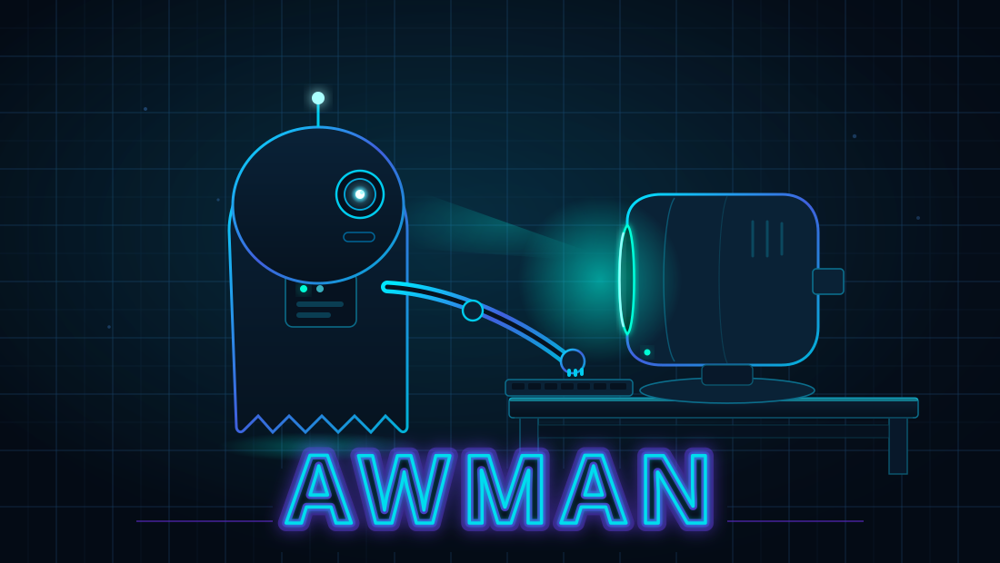
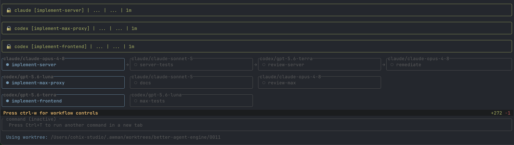

<p align="center">
  <strong>Run and coordinate AI code agents from your terminal.</strong> <br>
  Go from issue to PR with repeatable container-isolated workflows.<br>
  <br>
  
</p>

<p align="center">
  
</p>

---

`awman` (Agent Workflow Manager) is a developer tool that adds structure and automation to the whole agentic software development lifecycle: from issue to merged PR.

**4 stages of improved agentic software development with awman**
1. Isolate your code agents with containers and worktrees 🛑
2. Run multiple agents in parallel with the TUI 🔄
3. Turn your team's development lifecycle into repeatable workflows 📈
4. Automate the rest — build a squad of agents to tackle recurring work, fan out to your homelab or cluster with API mode 🤝


---

## Installation

```sh
curl -s https://prettysmart.dev/install/awman.sh | sh
```

The installer detects your platform and puts `awman` on your `PATH`.

<details>
<summary>Other installation options</summary>

**With mise** — using the [GitHub backend](https://mise.jdx.dev/dev-tools/backends/github.html):

```sh
mise use -g github:prettysmartdev/awman
```

To pin to a specific version: `mise use -g github:prettysmartdev/awman@0.12.0`

**From GitHub Releases** — download the binary for your platform from [GitHub Releases](https://github.com/prettysmartdev/awman/releases):

| Platform | Asset |
|----------|-------|
| Linux (x86_64) | `awman-linux-amd64` |
| Linux (ARM64) | `awman-linux-arm64` |
| macOS (Intel) | `awman-macos-amd64` |
| macOS (Apple Silicon) | `awman-macos-arm64` |
| Windows (x86_64) | `awman-windows-amd64.exe` |

**From source** — requires Rust 1.94+ and make:

```sh
git clone https://github.com/prettysmartdev/awman.git
cd awman
sudo make install
```

</details>

---

## Quick Start

```sh
# 1. Initialize your repo (once per project)
awman init

# 2. Open the TUI
awman

# 3. Start an agent session
chat

# 4. Optionally run the Dockerfile.dev refresh agent to
#    ensure all your project's tools get installed
ready --refresh
```

See the [Getting Started Guide](docs/00-getting-started.md) for a full walkthrough.

---

## What you can do with `awman`

### Run multiple agents at once

Open new tabs in the TUI with **Ctrl+T**. Each tab is independent — its own working directory, its own container — and keeps running in the background while you work in another tab. Switch with **Ctrl+A** / **Ctrl+D**.

When an agent goes quiet for 30 seconds, whether it's stuck or just finished and waiting on you, its tab turns yellow so you know where to look.


### Run structured workflows

A workflow breaks complex work into phases — plan → implement → review → docs. Each phase is a separate agent session in its own container, so you review the output between phases and decide whether to continue, retry, or redirect.

Workflows are TOML or YAML files in your repo. Steps declare their dependencies with `depends_on`, and independent steps run in parallel. Around them, setup and teardown phases prepare the branch and handle the finish: run tests, commit, push, open the PR, and block on CI until it goes green. Any of those can carry an `on_failure` block that launches an agent to fix the problem and retries.

Two things make this more than a prompt runner:

- **Per-step agents.** Any step can name the `agent` and `model` it runs with, so you can have Codex implement and Claude review in the same pipeline. Steps that don't specify one use your project's default.
- **Per-step overlays.** Each step declares exactly what it needs from the host — `ssh()` to push, `env(GITHUB_TOKEN)` to open a PR, `skill(review)` for a review checklist. Nothing gets host access it didn't ask for.



```sh
awman exec workflow ./aspec/workflows/implement-pr.toml --work-item 0027
```

The `--work-item` is optional: pass one to substitute a spec you've written into the prompts, or leave it off. See [Workflows](docs/05-workflows.md) for the full file format, template variables, and the control board.

When a step's agent dies, the workflow doesn't. The control board opens with the failure attached so you can retry the step, step back to the one before it, step over it, or pause — and a paused run picks up from a named step the next time you start it. Unattended runs (squad, the API server) retry a failed step once on their own before giving up.

<details>
<summary>A complete workflow file</summary>

```toml
title = "Implement Feature"

[[setup]]
type = "checkout_create_branch"
branch = "feature/{{work_item_number}}"
base = "main"

[[step]]
name = "plan"
prompt = "Read work item {{work_item_content}} and produce an implementation plan."

[[step]]
name = "implement"
depends_on = ["plan"]
agent = "codex"
prompt = "Implement work item {{work_item_number}} according to the plan."

[[step]]
name = "review"
depends_on = ["implement"]
agent = "claude"
prompt = "Review the implementation for correctness and style."
overlays = ["skill(review)"]

[[teardown]]
type = "run_shell"
command = "make test"

[[teardown]]
type = "commit_changes"
message = "Implement {{work_item_number}}"
add_all = true

[[teardown]]
type = "push_branch"
overlays = ["ssh()"]

[[teardown]]
type = "create_pull_request"
title = "Implement {{work_item_number}}"
overlays = ["env(GITHUB_TOKEN)"]
```

Supported agents: `claude`, `codex`, `opencode`, `maki`, `gemini`, `antigravity`, `copilot`, `crush`, `cline`.

</details>

Don't want to write the file at all? `awman exec workflow --dynamic --work-item 0027` puts a leader agent in a container, has it design a workflow for that work item, validates the result, and runs it. See [Dynamic Workflows](docs/06-dynamic-workflows.md).

### Create a squad to automate your work

Workflows still need you to start them. Your **squad** is a group of agents that work on your behalf while you're doing something else. You give the squad tasks — "when a new issue is opened, triage it and post a plan", "if any open PR has failing tests, fix them" — and it watches for each one and runs a workflow when it fires.

```sh
awman squad start --background
awman squad add --name issue-triage \
  --description "When a new issue is opened, analyze it and post a plan as a comment." \
  --interval 30m --overlay "env(GITHUB_TOKEN)"
```

On each interval one of your squad's agents decides whether the condition is actually met. If it is, the squad designs and runs a workflow for it unattended. Each task gets a durable workspace that persists across runs, so state carries between them.

Run `awman squad` for a TUI tab showing every task your squad is on as a card with its last and next run — press **Enter** for details, **t** to have the squad tackle a task right now, **a** to attach to a live run. See [squad](docs/12-squad.md).

### Hand off completely (yolo mode)


`--yolo` configures an agent to use its built-in "no permission checks" mode and keeps a workflow moving without you. Use it when the task is well specified and you want to come back to a finished result.

```sh
awman exec workflow ./aspec/workflows/implement-pr.toml --yolo --work-item 0042
```

When a workflow step agent completes its work, a 60-second countdown starts and then advances the workflow automatically; any output from the agent cancels it. The countdown shows in the tab bar, so you can watch several autonomous runs at once without switching between them.

With `exec workflow`, `--yolo` automatically runs in an isolated Git worktree — review the whole diff as a unit and merge or discard it. For lighter autonomy, `--auto` approves file edits but still asks before shell commands.

### Run agents on other machines

`awman api start` exposes awman over HTTP, so heavy workflows can run on a build server or a fleet of agent-runner boxes instead of your laptop.

```sh
# On the remote machine (prints an API key on first run)
awman api start --port 9090
```

```sh
# From your laptop
awman config set --global remote.defaultAddr <host>
awman config set --global remote.defaultAPIKey <key>
awman remote session start --workdir /workspace/myproject
awman remote exec workflow aspec/workflows/implement-pr.toml --work-item 0027 --session <id> --follow
```

Remote commands run in containers with the same isolation as local ones, and every input, output, and log is kept on the server under `~/.awman/api/` for auditing. The HTTP API is available directly to any client too. See [API & Remote Mode](docs/09-api-and-remote-mode.md).

### Curate your skills library

Build up a library of the skills your agents should have on hand — the ones you write, plus published libraries you pull in from GitHub — and mount exactly what a given session needs:

```sh
awman new skill --pull github.com/obra/superpowers
awman chat --overlay "skill(superpowers)"                # the whole library
awman chat --overlay "skill(superpowers/brainstorming)"  # one skill from it
```

`awman new skill --pull <name>` refreshes a library already in your collection, and `--pull-all` refreshes every one of them, so the set stays current as upstream evolves. Pulled libraries live under `~/.awman/skills/.library/` and your own skills under `~/.awman/skills/<name>/` — separate shelves, one library, the same `skill()` syntax over both. See [Pulled skill libraries](docs/03-agent-sessions.md#pulled-skill-libraries).

### Start from a GitHub issue

Point `new spec`, `exec workflow`, or `exec prompt` at an issue with `--issue` — no local work item file needed:

```sh
awman new spec --issue 84                    # turn an issue into a work item spec
awman exec workflow ./implement-pr.toml --issue 84 --worktree
awman exec prompt "Security review this" --issue 84
```

A bare number resolves against the repo's GitHub remote; `owner/repo#84` and full URLs work too. Issues are fetched via the `gh` CLI, a `GITHUB_TOKEN`, or unauthenticated for public repos. See [GitHub Integration](docs/10-github-integration.md).

---

## Security and Isolation

Every agent runs inside a container built from `Dockerfile.dev` — agents never touch your host machine directly.

- Only the current Git repository is mounted into the container by default
- Credentials are passed as environment variables and masked in displayed commands. Claude Code is the exception: it gets an awman-authored credential file holding the access token only, kept refreshed for as long as the session runs — your OAuth refresh token never leaves the host
- Overlays are the only way in: opt a session into SSH keys, env vars, extra directories, or your skills library, one at a time
- awman itself is a statically compiled Rust binary — nothing running in a container can modify it

Docker, Apple Containers (macOS 26+), and Docker Sandboxes (`docker-sbx-experimental`, microVM isolation) are supported runtimes. See [Runtimes](docs/11-runtimes.md) and [Security & Isolation](docs/04-security-and-isolation.md).


---

## Commands

```sh
awman                                  # open the TUI
awman init [--agent <name>]            # set up a project
awman ready [--refresh]                # verify environment; rebuild Dockerfile.dev
awman chat [--agent <name>] [--plan] [--auto] [--yolo] [--launch-mode <stdio|acp>]
awman exec prompt "<prompt>" [--issue <ref>]   # run a one-off prompt in a container
awman exec workflow <path> [--work-item <nnnn> | --issue <ref>] [--yolo] [--worktree]
awman exec workflow --dynamic --work-item <nnnn> [--leader <agent::model>]   # let a leader agent design the workflow
awman new spec [--interview] [--issue <ref>]   # create a work item (optionally from a GitHub issue)
awman new workflow [--interview]       # create a workflow file
awman new skill [--interview]          # create a skill file
awman new skill --pull <repo> | --pull-all     # pull or refresh a published skills library from GitHub
awman specs amend <nnnn>               # update a spec to match what was built
awman status [--watch]                 # dashboard of all running agent containers
awman clean [--dry-run] [--yes]        # remove stopped containers, stale images, and completed workflow data
awman config show                      # view all config values
awman squad                            # open your squad's TUI tab
awman squad start [--background]       # put your squad on duty (starts the squad daemon)
awman squad add --name <name> --description <text> [--interval <dur>]   # create a new task for your squad to tackle
awman squad trigger <name>             # have your squad tackle a task now, ignoring its schedule
awman squad cancel <name>              # stop the run a task has in progress
awman squad attach <name>              # attach to a task's running container
awman squad env [--push | --clear]     # report which env() values your squad's daemon holds
awman squad list | show <name> | edit <name> | pause <name> | resume <name> | remove <name>
awman squad stop | status | logs       # squad daemon lifecycle
awman api start [--port <n>]           # start the HTTP API server (generates API key on first run)
awman api status | kill                # check or stop the API server
awman remote session start --workdir <dir>     # create a session on a remote server
awman remote exec workflow <path> [--follow]   # run a workflow on a remote API server
awman remote exec prompt "<text>" [--follow]   # run a one-shot prompt on a remote API server
```

Every subcommand works in CLI mode and in the TUI command box (without the `awman` prefix). API mode accepts `exec prompt` and `exec workflow`.

---

## Documentation

- [Getting Started](docs/00-getting-started.md)
- [Concepts](docs/01-concepts.md)
- [Using the TUI](docs/02-using-the-tui.md)
- [Agent Sessions](docs/03-agent-sessions.md)
- [Security & Isolation](docs/04-security-and-isolation.md)
- [Workflows](docs/05-workflows.md)
- [Dynamic Workflows](docs/06-dynamic-workflows.md)
- [Configuration](docs/07-configuration.md)
- [Overlays](docs/08-overlays.md)
- [API & Remote Mode](docs/09-api-and-remote-mode.md)
- [GitHub Integration](docs/10-github-integration.md)
- [Runtimes](docs/11-runtimes.md)
- [squad](docs/12-squad.md)
- [Cleaning Up](docs/13-cleaning-up.md)
- [Architecture](docs/architecture.md)

---

## License

See [LICENSE](LICENSE) for details.
